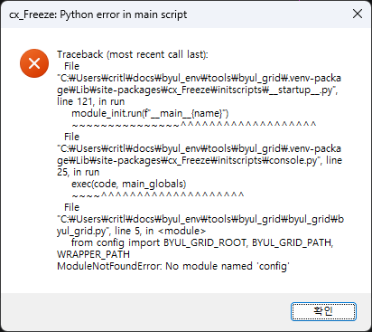
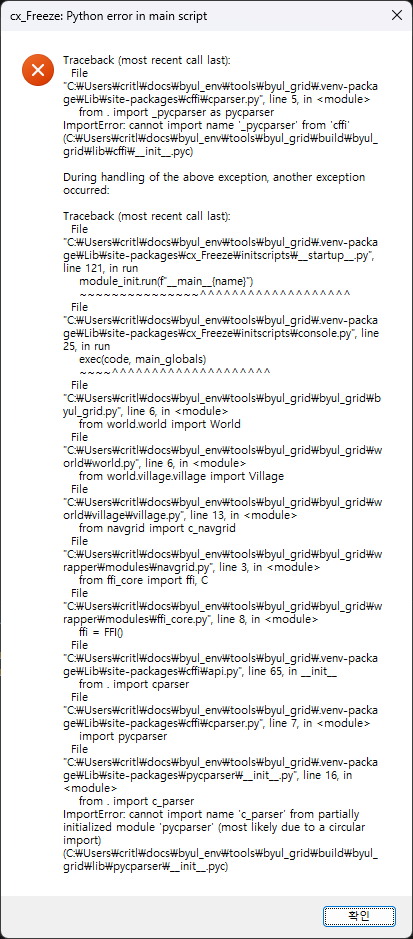
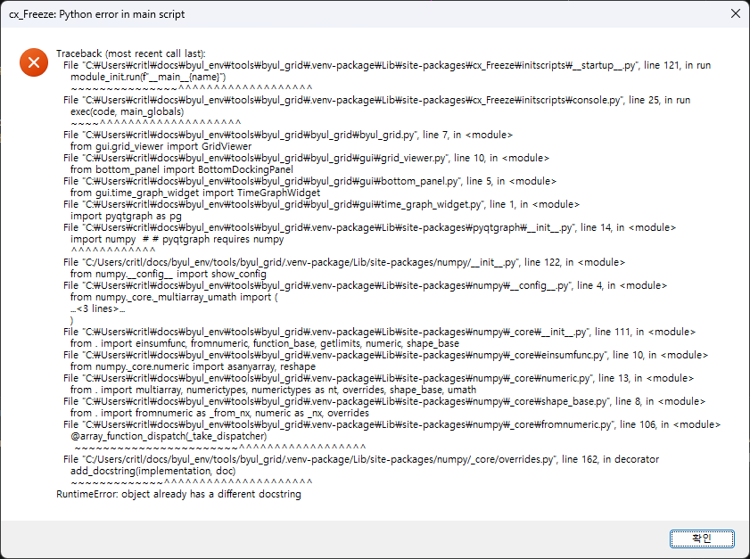

# BYUL Grid cx_Freeze 패키징과 버그 수정 기록

## 문서 목적

이 문서는 `tools/python/byul_grid`를 cx_Freeze로 독립 실행형 애플리케이션으로 만드는
방법과 Windows 패키징 과정에서 확인한 세 가지 시작 오류의 원인, 수정 내용,
검증 방법을 기록합니다.

이 문서가 다루는 오류는 다음과 같습니다.

1. 내부 모듈 `config` 누락
2. `pycparser`의 불완전한 수집과 순환 import 오류
3. 구형 cx_Freeze와 최신 NumPy 조합의 초기화 오류

## 패키징 도구 선택 배경: Windows 11 백신 오진

### cx_Freeze를 선택한 이유

BYUL Grid가 cx_Freeze를 사용하는 첫 번째 이유는 단순한 사용 편의가 아닙니다.
이전에 PyInstaller로 만든 Windows 실행 파일이 Windows 11 보안 제품에서 악성
프로그램으로 오진되는 문제가 있었고, 이 문제를 피하기 위해 cx_Freeze의
디렉터리 배포 방식을 선택했습니다.

PyInstaller 프로젝트의 공식 이슈에서도 `--onefile` 결과가 여러 백신과
Windows에서 차단된 사례가 보고됐습니다. 프로젝트 관리자는 많은 악성 코드가
PyInstaller를 사용하고 모든 결과물에 공통 bootloader가 들어가는 점을 원인으로
설명하며 코드 서명을 중요한 대응으로 제시했습니다.
[PyInstaller issue #6754](https://github.com/pyinstaller/pyinstaller/issues/6754),
[PyInstaller issue #4852](https://github.com/pyinstaller/pyinstaller/issues/4852)

현재 선택은 다음 가정에 기반합니다.

```text
단일 파일 + 자체 압축 해제 bootloader
    상대적으로 휴리스틱 탐지에 불리할 가능성이 있음

일반 EXE + 명시적인 Python/DLL/패키지 디렉터리
    파일 구성이 투명하고 자체 압축 해제 동작이 없어 상대적으로 유리할 가능성이 있음
```

이는 패키징 구조에 따른 위험 추정이지, cx_Freeze의 오진율이 항상 더 낮다는
통계적 보장은 아닙니다.

### 오진 확률에 관한 한계

주요 패키징 도구를 동일한 애플리케이션, 동일한 Python, 동일한 Windows 버전,
동일한 코드 서명 상태로 반복 측정한 공인 데이터셋은 확인되지 않았습니다.
따라서 다음과 같은 절대 수치는 문서화할 수 없습니다.

```text
PyInstaller 오진 확률: N%
cx_Freeze 오진 확률: M%
Nuitka 오진 확률: K%
```

탐지 결과는 다음 요인에 따라 바뀝니다.

- 패키징 도구와 bootloader 버전
- one-file 또는 directory/standalone 모드
- 압축기와 실행 시 임시 압축 해제 여부
- 포함된 DLL, Python 확장 모듈, 네이티브 BYUL 라이브러리
- 빌드마다 달라지는 파일 해시
- Authenticode 코드 서명과 타임스탬프
- 인증서와 게시자의 SmartScreen 평판
- 다운로드 출처와 파일 보급량
- 각 백신 엔진의 정의 및 클라우드 휴리스틱 갱신

특히 Windows Defender의 악성 코드 탐지와 Microsoft SmartScreen의 “알 수 없는
게시자/평판 부족” 경고는 같은 현상이 아닙니다. 도구 비교 시 두 결과를 분리해야
합니다.

## Python 애플리케이션 패키징 도구 비교

여기서 “모든 도구”는 BYUL Grid처럼 PySide6 GUI, CFFI, NumPy/Pandas,
`byul.dll`/`libbyul.so`를 포함하고 Python이 설치되지 않은 PC에서 실행해야 하는
프로젝트에 현실적으로 검토할 가치가 있는 주요 도구를 뜻합니다. 이름만 Python
패키징과 관련됐지만 독립 GUI 실행 파일을 만들지 않는 도구는 별도 항목으로
구분합니다.

### 1. cx_Freeze

cx_Freeze는 Python 애플리케이션과 인터프리터, 공유 라이브러리를 일반적으로
하나의 디렉터리에 배치합니다. 공식 문서도 기본 결과가 실행 파일과 DLL 또는
`.so`가 들어 있는 폴더라고 설명합니다.
[cx_Freeze overview](https://cx-freeze.readthedocs.io/en/stable/overview.html)

장점:

- Windows, Linux, macOS를 지원한다.
- 기본 directory 배포는 실행 시 자기 자신을 임시 폴더에 풀지 않는다.
- Python 모듈, DLL, 리소스 위치를 직접 검사할 수 있다.
- 현재 BYUL Grid의 PySide6, CFFI, NumPy, BYUL DLL 구성이 검증됐다.
- Windows에서는 MSI, Linux에서는 AppImage, macOS에서는 DMG 단계로 확장할 수
  있다.

단점:

- `lib`, `share`, Python DLL 등 많은 파일을 함께 배포해야 한다.
- 정적 분석이 동적 import를 놓치면 `includes`, `path`, `include_files` 설정이
  필요하다.
- cx_Freeze도 공통 launcher를 사용하므로 백신 오진이 절대 발생하지 않는다고
  보장할 수 없다.

백신 관점의 현재 판단:

```text
상대 위험 추정: 낮음~중간
근거: directory 구조, 실행 시 자체 압축 해제 없음
확정 오진율: 자료 없음
```

현재 BYUL Grid 기준선으로 유지합니다.

### 2. PyInstaller

PyInstaller는 Windows, Linux, macOS에서 사용할 수 있으며 one-folder와 one-file
모드를 제공합니다. 플랫폼 간 cross-compiler는 아니므로 대상 OS에서 각각
빌드해야 합니다.
[PyInstaller manual](https://pyinstaller.org/en/stable/index.html),
[PyInstaller operating mode](https://www.pyinstaller.org/en/stable/operating-mode.html)

장점:

- 가장 널리 사용되는 Python freezer 중 하나다.
- PySide/PyQt, NumPy 등 주요 패키지 hook 생태계가 크다.
- one-folder와 one-file을 모두 지원한다.

단점:

- 공식 이슈에 Windows 및 다중 백신 오진 사례가 반복적으로 보고됐다.
- one-file은 bootloader가 실행 시 내용을 임시 경로에 푸는 구조다.
- 널리 공유되는 bootloader가 악성 코드에도 사용돼 휴리스틱 표적이 될 수 있다.

백신 관점의 현재 판단:

```text
PyInstaller one-file: 상대 위험 추정 높음
PyInstaller one-folder: 상대 위험 추정 중간
확정 오진율: 자료 없음
```

BYUL Grid가 cx_Freeze로 이동한 직접적인 원인이므로, 같은 문제가 재현되는 동안은
기본 도구로 복귀하지 않습니다. 향후 비교할 때는 one-file이 아니라 one-folder도
별도로 측정해야 합니다.

### 3. Nuitka

Nuitka는 Python 코드를 C로 변환하고 C 컴파일러로 빌드합니다. 독립 배포에는
`standalone`, `onefile`, `app` 모드를 사용합니다.
[Nuitka user manual](https://nuitka.net/user-documentation/user-manual.html)

장점:

- 단순히 `.pyc`를 묶는 방식보다 네이티브 컴파일 결과에 가깝다.
- Windows에서 MSVC 또는 MinGW64를 사용할 수 있다.
- standalone과 one-file을 모두 제공한다.
- 일부 Python 코드에서 실행 성능 개선 가능성이 있다.

단점:

- C 컴파일 단계 때문에 빌드가 더 느리고 툴체인이 복잡하다.
- PySide6, Pandas, CFFI, 플러그인별 옵션 검증이 필요하다.
- one-file은 역시 단일 파일 launcher/압축 해제 특성을 가지며, Nuitka라고 해서
  오진이 사라진다는 공식 보장은 없다.
- 컴파일 오류와 패키지별 호환 문제의 진단 비용이 cx_Freeze보다 클 수 있다.

백신 관점의 현재 판단:

```text
Nuitka standalone: cx_Freeze보다 낮을 가능성이 있는 최우선 실험 후보
Nuitka one-file: 중간~높음 가능성, 별도 측정 필요
확정 오진율: 자료 없음
```

Nuitka standalone이 동일한 기능 테스트를 통과하면서 Defender 및 다중 엔진에서
cx_Freeze보다 반복적으로 적게 탐지된다면 전환 후보가 됩니다.

### 4. BeeWare Briefcase

Briefcase는 Python 프로젝트를 플랫폼의 네이티브 애플리케이션 형태로 포장합니다.
Windows에서는 앱 폴더, ZIP, WiX 기반 MSI를 만들며 Python.org의 Windows
embeddable 배포본을 사용합니다.
[Briefcase overview](https://briefcase.beeware.org/en/stable/index.html),
[Briefcase Windows reference](https://briefcase.beeware.org/en/stable/reference/platforms/windows/)

장점:

- Windows MSI/ZIP, macOS app, Linux 네이티브 패키지까지 배포 단계가 명확하다.
- Windows에서 공식 Python embeddable 배포본과 네이티브 설치 형식을 사용한다.
- 코드 서명 절차가 공식 문서와 명령 옵션에 통합돼 있다.
- 모바일과 Web까지 확장 가능한 프로젝트 구조를 제공한다.

단점:

- 현재의 자유로운 스크립트 디렉터리를 Briefcase 앱 프로젝트 구조로 옮기는 작업이
  필요하다.
- PySide6 중심 앱은 BeeWare/Toga 예제와 다른 경로이므로 실제 호환성 검증이
  필요하다.
- CFFI와 외부 `byul.dll` 포함 및 로딩 규칙을 새로 작성해야 한다.
- 네이티브 설치 형식이 백신 오진을 줄일 가능성은 있지만 보장된 비교 수치는 없다.

백신 관점의 현재 판단:

```text
Briefcase ZIP/MSI: 낮을 가능성이 있는 최우선 실험 후보
근거: 공식 embeddable Python + 일반 앱 폴더/MSI + 서명 통합
확정 오진율: 자료 없음
```

백신 결과가 cx_Freeze보다 명확히 우수하다면 배포 도구 교체 가치가 큽니다.
특히 최종적으로 설치 프로그램과 코드 서명을 도입할 계획이라면 Nuitka보다
Briefcase를 먼저 검토할 이유가 있습니다.

### 5. py2exe

py2exe는 Python 스크립트를 Python 설치가 필요 없는 Windows 프로그램으로
만드는 Windows 전용 도구입니다.
[py2exe official site](https://www.py2exe.org/),
[py2exe PyPI](https://pypi.org/project/py2exe/)

장점:

- Windows 실행 파일 생성이라는 목적이 명확하다.
- console과 GUI 실행 파일을 모두 지원한다.
- Python 3과 현재 공식 지원 주기의 Python을 지원한다.

단점:

- Windows 전용이므로 동일 설정으로 Linux/macOS를 처리할 수 없다.
- BYUL Grid의 크로스 플랫폼 빌드 스크립트를 별도 체계로 나누게 된다.
- PySide6/CFFI/NumPy 최신 조합과 오진 특성을 별도로 검증해야 한다.
- 오진율이 cx_Freeze보다 낮다는 공식 비교 자료가 없다.

백신 관점의 현재 판단:

```text
상대 위험 추정: 불명
BYUL Grid 적합성: 낮음~중간
```

Windows만 따로 최적화할 특별한 이유가 생기기 전에는 우선순위가 낮습니다.

### 6. PyOxidizer

PyOxidizer는 Rust 실행 파일에 Python 인터프리터와 리소스를 포함할 수 있으며
단일 실행 파일 생성도 목표로 합니다.
[PyOxidizer documentation](https://pyoxidizer.readthedocs.io/en/stable/index.html),
[PyOxidizer repository](https://github.com/indygreg/PyOxidizer)

장점:

- Rust 기반 네이티브 launcher와 메모리 기반 모듈 import 구조를 제공한다.
- Python과 리소스를 단일 바이너리에 포함할 수 있다.
- 일반 freezer와 다른 바이너리 특성 때문에 오진 패턴이 다를 가능성이 있다.

단점:

- 마지막 공개 릴리스와 프로젝트 활동 상태를 배포 도입 전에 반드시 재확인해야
  한다.
- NumPy, PySide6, CFFI 같은 바이너리 확장 패키지는 메모리 import만으로 처리할
  수 없어 별도 파일 배치가 필요할 수 있다.
- Rust 툴체인과 새로운 설정 체계를 도입해야 한다.
- 단일 바이너리라는 사실 자체가 낮은 오진율을 보장하지 않는다.

백신 관점의 현재 판단:

```text
상대 위험 추정: 불명
기술 실험 가치: 있음
유지보수 위험: 현재 도입 전 재평가 필요
```

현 시점의 즉시 교체 후보보다는 장기 실험 후보입니다.

### 6-1. Pynsist

Pynsist는 embeddable Python, 런타임, 애플리케이션 패키지와 파일을 모아 NSIS 기반
Windows 설치 프로그램을 만듭니다.
[Pynsist documentation](https://pynsist.readthedocs.io/),
[Pynsist installer details](https://pynsist.readthedocs.io/en/stable/installers.html)

장점:

- 일반 Python freezer의 공통 bootloader 대신 embeddable Python과 launcher,
  NSIS 설치 프로그램을 사용한다.
- 시작 메뉴, 제거 프로그램, 레지스트리 항목을 관리한다.
- Windows 설치형 배포를 비교적 단순하게 만들 수 있다.
- 구조가 PyInstaller one-file과 달라 오진 결과가 더 좋을 가능성이 있다.

단점:

- Windows 전용 배포 경로다.
- Linux/macOS는 별도 도구가 필요하다.
- NSIS installer 자체와 내부 launcher를 각각 서명하고 스캔해야 한다.
- PySide6, CFFI, `byul.dll` 포함을 직접 검증해야 한다.

백신 관점의 현재 판단:

```text
상대 위험 추정: 낮을 가능성은 있으나 불명
BYUL Grid 적합성: Windows 설치 프로그램 후보
```

Briefcase MSI와 함께 Windows 설치형 비교군으로 사용할 수 있지만 크로스 플랫폼
기본 freezer를 완전히 대체하지는 못합니다.

### 7. Python 표준 `zipapp`, Shiv, PEX

Python `zipapp`, Shiv, PEX는 Python 코드와 의존성을 실행 가능한 ZIP 또는 Python
환경 형태로 묶습니다.
[Python zipapp](https://docs.python.org/3/library/zipapp.html),
[Shiv documentation](https://shiv.readthedocs.io/en/latest/),
[PEX documentation](https://docs.pex-tool.org/)

장점:

- Python 서버/CLI 배포에 단순하고 재현 가능한 단일 아카이브를 만들 수 있다.
- Shiv와 PEX는 의존성 환경을 함께 묶는 기능을 제공한다.

BYUL Grid에 부적합한 이유:

- 표준 zipapp은 대상 시스템에 호환 Python이 필요하다.
- 네이티브 `.pyd`, `.dll`, `.so`는 일반 ZIP 내부에서 직접 로드하기 어렵다.
- Shiv는 바이너리 의존성을 파일 시스템 캐시로 압축 해제한다.
- Windows 데스크톱 GUI EXE와 설치 경험을 직접 제공하는 도구가 아니다.

따라서 백신 오진 비교 대상이 아니라 Python이 이미 설치된 개발/서버 환경용
배포 수단으로 분류합니다.

### 8. py2app

py2app은 macOS 애플리케이션 번들 생성 도구입니다. Windows 실행 파일을 만들지
않으므로 Win11 백신 오진 문제의 대안이 아닙니다. macOS 전용 패키징을 별도로
최적화할 때만 후보가 됩니다.

### 9. Cython

Cython은 Python 코드를 C/C++ 확장 또는 실행 코드로 변환할 수 있지만, 그 자체로
PySide6 앱과 Python 런타임 및 모든 의존성을 완성된 데스크톱 배포물로 조립하는
도구는 아닙니다. 일부 핵심 모듈 컴파일에는 사용할 수 있지만 cx_Freeze를 직접
대체하지 않습니다.

### 10. conda-pack, virtualenv 복사, embeddable Python 수동 배포

이 계열은 Python 환경 전체를 복사하거나 압축합니다. 가장 투명한 파일 구조를
만들 수 있지만 다음 작업을 직접 책임져야 합니다.

- GUI launcher 생성
- 시작 메뉴와 제거 기능
- DLL 검색 경로
- 리소스 상대 경로
- 라이선스 수집
- 코드 서명과 설치 프로그램

Briefcase는 이 수동 방식에 가까운 문제를 플랫폼 프로젝트와 설치 명령으로
관리해 주는 상위 대안입니다.

### 11. Inno Setup, NSIS, WiX, MSIX

이들은 Python freezer가 아니라 설치 프로그램 제작 기술입니다. cx_Freeze,
Nuitka, Briefcase 앱 폴더를 설치 파일로 감싸고 코드 서명과 설치/제거 경험을
제공할 수 있습니다.

설치 프로그램을 사용한다고 내부 EXE의 악성 코드 탐지가 자동으로 없어지지는
않습니다. 그러나 서명된 MSI/MSIX와 일관된 게시자 정보는 SmartScreen 신뢰와
배포 품질 개선에 중요합니다. Briefcase는 Windows MSI에 WiX를 사용하고 코드
서명 절차를 제공합니다.
[Briefcase Windows code signing](https://briefcase.beeware.org/en/stable/how-to/code-signing/windows/)

### 12. PyInstaller 프런트엔드와 프로젝트 템플릿

다음 도구들은 독립 패키징 엔진으로 계산하지 않습니다.

```text
auto-py-to-exe
fbs
PyInstaller GUI/front-end 계열
PyInstaller spec 생성 도구
```

`auto-py-to-exe`는 사용자 인터페이스에서 설정을 받은 뒤 PyInstaller를 실행하는
프런트엔드입니다. 결과 바이너리와 bootloader 특성은 PyInstaller 선택에
귀속되므로 별도의 낮은 오진율 후보가 아닙니다.
[auto-py-to-exe PyPI](https://pypi.org/project/auto-py-to-exe/)

fbs도 Qt 애플리케이션 프로젝트와 PyInstaller 설정을 편리하게 구성하는 계층으로
분류합니다. 프런트엔드를 바꿔도 PyInstaller bootloader를 사용한다면 BYUL Grid가
경험한 핵심 오진 위험은 본질적으로 동일합니다.

### 13. Qt 특화 배포 도구

`pyqtdeploy` 같은 Qt 특화 도구도 존재하지만 PyQt 중심의 빌드·sysroot 구성을
전제로 합니다. BYUL Grid는 PySide6를 사용하므로 바인딩, 라이선스, Qt 플러그인,
CFFI 통합을 다시 설계해야 합니다. 단순 패키징 도구 교체 범위를 넘어가므로 현재
비교 실험에서는 제외합니다.

Qt의 공식 배포 도구(`windeployqt`, `macdeployqt`)는 Qt DLL과 플러그인을 수집하는
도구이지 Python 인터프리터와 Python 패키지를 독립 실행 앱으로 만드는 freezer가
아닙니다. cx_Freeze, Nuitka, Briefcase 같은 상위 도구의 Qt 파일 배치를 보조할 수
있습니다.

### 14. 유지보수 중단 또는 역사적 도구

`bbfreeze`, 오래된 `freeze.py`, Python 2 중심의 도구처럼 최신 Python 3.13,
PySide6, NumPy를 대상으로 유지보수되지 않는 프로젝트는 이름이 존재하더라도
배포 후보에서 제외합니다. 백신 오진이 낮아 보여도 보안 업데이트와 최신 Python
호환성이 없으면 BYUL Grid의 장기 배포 도구로 사용할 수 없습니다.

## 도구별 BYUL Grid 적합성 요약

아래 “오진 위험”은 공식 확률이 아니라 패키징 구조와 공개 이슈에 근거한 상대적
실험 우선순위입니다.

| 도구/모드 | Win11 독립 실행 | Linux/macOS | 네이티브 확장 | 추정 오진 위험 | BYUL Grid 판단 |
|---|---:|---:|---:|---|---|
| cx_Freeze directory | 예 | 예 | 양호, 설정 필요 | 낮음~중간 | 현재 기준선 |
| PyInstaller one-file | 예 | 예 | hook 생태계 큼 | 높음 | 현재 제외 |
| PyInstaller one-folder | 예 | 예 | hook 생태계 큼 | 중간 | 비교군 |
| Nuitka standalone | 예 | 예 | 플러그인 검증 필요 | 낮을 가능성 | 최우선 시험 후보 |
| Nuitka one-file | 예 | 예 | 플러그인 검증 필요 | 중간~높음 가능성 | 후순위 |
| Briefcase ZIP/MSI | 예 | 예 | 앱 구조 검증 필요 | 낮을 가능성 | 최우선 시험 후보 |
| py2exe | 예 | 아니요 | 별도 검증 필요 | 불명 | Windows 전용 후순위 |
| Pynsist | 설치 프로그램 | 아니요 | 수동 구성 필요 | 낮을 가능성/불명 | Windows 설치형 비교군 |
| PyOxidizer | 예 | 예 | 복잡 | 불명 | 장기 실험 후보 |
| zipapp/Shiv/PEX | 제한적 | 제한적 | 부적합 | 비교 의미 낮음 | 대상 제외 |
| py2app | 아니요 | macOS 전용 | macOS 대상 | Win11 해당 없음 | macOS 전용 후보 |
| Cython | 단독으로 불충분 | 예 | 컴파일 도구 | 비교 의미 없음 | 보조 기술 |

## 패키징 도구 교체를 위한 실측 계획

도구 교체는 인터넷의 단일 VirusTotal 결과나 “오진이 적다”는 경험담만으로
결정하지 않습니다. 다음 후보를 동일 조건으로 비교합니다.

```text
기준선: cx_Freeze directory
후보 1: Nuitka standalone
후보 2: Briefcase Windows ZIP
후보 3: Briefcase MSI
후보 4: Pynsist NSIS installer
참고군: PyInstaller one-folder
제외 확인군: PyInstaller one-file
```

### 고정 조건

- 같은 BYUL Grid Git 커밋
- 같은 `byul.dll`
- 같은 Python과 PySide6/NumPy/CFFI 버전
- 같은 아이콘과 버전 정보
- UPX 및 추가 실행 압축 사용 안 함
- 디버그 파일 제외 조건 통일
- 최초 비교는 모두 미서명
- 두 번째 비교는 동일한 Authenticode 인증서와 타임스탬프로 서명
- 각 도구에서 최소 3회 클린 빌드

### 기록 항목

각 결과물에 대해 다음을 기록합니다.

```text
도구와 정확한 버전
빌드 명령 및 설정 파일
빌드 일시와 Windows 빌드 번호
SHA-256
패키지 전체 크기와 파일 수
Windows Defender 탐지명 및 조치
SmartScreen 경고 여부
VirusTotal 탐지 엔진 수와 탐지명
EXE 시작 성공 여부
PySide6 화면, CFFI, byul.dll, 이미지 로딩 기능 테스트
첫 실행 시간과 두 번째 실행 시간
```

VirusTotal에 업로드하면 파일이 외부 보안 업체에 공유될 수 있으므로 비공개 코드와
자산의 공개 가능성을 먼저 검토해야 합니다. 공개 배포 후보에 한해 수행하는 것이
안전합니다.

### 테스트 환경

다음 상태의 Win11 환경을 분리해 사용합니다.

1. 빌드 머신: 패키징만 수행한다.
2. 깨끗한 Win11 VM: Python과 개발 도구가 없는 상태로 실행한다.
3. 반복 실행 VM: 동일 파일의 평판 변화와 업데이트 후 결과를 확인한다.
4. 오프라인 Defender VM: 로컬 정의 기반 탐지를 확인한다.
5. 온라인 Defender VM: 클라우드 제공 보호를 포함한 결과를 확인한다.

### 전환 조건

다른 도구로 전환하려면 다음 조건을 모두 만족해야 합니다.

- BYUL Grid의 GUI, 그래프, 이미지, CFFI, `byul.dll` 기능 테스트를 통과한다.
- 깨끗한 Win11에서 Defender가 반복 빌드를 차단하지 않는다.
- cx_Freeze보다 다중 엔진 탐지 수가 반복적으로 낮다.
- 결과가 한 번의 우연한 해시 차이가 아니라 최소 3개 빌드에서 유지된다.
- Windows뿐 아니라 Linux/macOS 빌드 전략이 명확하다.
- 빌드 시간과 설정 복잡도가 유지 가능한 수준이다.
- 라이선스와 재배포 조건을 충족한다.
- 코드 서명과 업데이트 절차를 자동화할 수 있다.

### 현재 결론

현재는 다음 순서를 유지합니다.

```text
1. cx_Freeze directory 배포를 기준선으로 유지
2. Authenticode 코드 서명 도입
3. Nuitka standalone 시험 빌드
4. Briefcase ZIP/MSI 시험 빌드
5. 동일 Win11 VM과 동일 서명 조건으로 결과 비교
6. 실측 결과가 cx_Freeze보다 명확히 좋을 때만 교체
```

구조적으로는 Briefcase와 Nuitka standalone이 가장 의미 있는 대안입니다.
그러나 현재 공개 자료만으로 어느 도구가 cx_Freeze보다 “몇 퍼센트” 적게
탐지된다고 결론내릴 수 없습니다. 따라서 cx_Freeze 선택은 합리적인 현재
기준선이며, 향후 전환은 위 실측 결과로 결정합니다.

## 백신 오진을 줄이는 공통 배포 원칙

패키징 도구 교체보다 다음 조치가 더 일관된 효과를 낼 수 있습니다.

1. one-file과 실행 압축을 피하고 directory/standalone을 우선한다.
2. UPX 같은 추가 패커를 사용하지 않는다.
3. EXE와 설치 프로그램에 Authenticode 서명을 적용한다.
4. 서명에 신뢰할 수 있는 타임스탬프를 추가한다.
5. 회사명, 제품명, 버전, 설명 등 Windows 버전 리소스를 일관되게 넣는다.
6. HTTPS의 고정된 공식 배포 도메인에서 제공한다.
7. 매 릴리스의 SHA-256과 서명 검증 방법을 공개한다.
8. Defender 오진은 Microsoft 제출 포털을 통해 샘플과 함께 신고한다.
9. 출시 전에 깨끗한 VM에서 스캔 및 설치 테스트를 자동화한다.
10. bootloader, Python, 패키징 도구를 최신 안정 버전으로 유지한다.

코드 서명은 악성 코드가 아님을 수학적으로 증명하지는 않지만, 게시자 신원과
파일 무결성을 제공하고 Windows의 신뢰 경고를 줄이는 핵심 수단입니다. Briefcase
공식 문서도 Windows 코드 서명이 사용자의 위험 경고를 줄이는 데 도움이 된다고
설명합니다.
[Briefcase Windows code signing](https://briefcase.beeware.org/en/stable/how-to/code-signing/windows/)

## 관련 파일

```text
tools/python/byul_grid/build_byul_grid.py
tools/python/byul_grid/build_byul_grid.bat
tools/python/byul_grid/build_byul_grid.sh
tools/python/byul_grid/setup_freeze.py
tools/python/requirements-package.txt
tools/python/byul_grid/byul_grid/config.py
tools/python/byul_wrapper/byul_wrapper/ffi_core.py
```

`.bat`와 `.sh`는 얇은 플랫폼 래퍼이며, 가상환경 준비와 패키징 흐름은
`build_byul_grid.py`가 담당합니다. cx_Freeze에 전달하는 모듈·파일 설정은
`setup_freeze.py`에 있습니다.

## 패키징 환경

패키징 전용 가상환경은 런타임·개발 환경과 분리합니다.

```text
tools/python/.venv
```

`build_byul_grid.py`는 다음 순서로 환경을 준비합니다.

1. 공용 `tools/python/.venv`가 없으면 현재 Python으로 생성한다.
2. `requirements-package.txt`와 `requirements.txt`의 SHA-256을 계산한다.
3. 저장된 해시와 다르면 패키징 의존성을 다시 설치한다.
4. 기존 플랫폼 산출물을 정리한다.
5. cx_Freeze `build_exe`를 실행한다.
6. 네이티브 라이브러리와 라이선스 문서를 플랫폼 구조에 맞게 정리한다.

현재 확인된 핵심 패키징 버전은 다음과 같습니다.

```text
cx_Freeze==8.6.4
Python 3.13
NumPy 2.5.1
pycparser 3.00
PySide6 6.9.0
```

## 오류 1: `No module named 'config'`



### 증상

패키징된 `byul_grid.exe`를 시작하면 진입 스크립트의 다음 import에서 중단됐습니다.

```python
from config import BYUL_GRID_ROOT, BYUL_GRID_PATH, WRAPPER_PATH
```

대표 오류:

```text
ModuleNotFoundError: No module named 'config'
```

### 원인

BYUL Grid의 기존 Python 코드는 다음 디렉터리를 각각 최상위 import 루트처럼
사용합니다.

```text
byul_grid/
byul_grid/gui/
byul_grid/wrapper/modules/
```

소스 실행에서는 `config.py`가 `sys.path`를 변경하기 때문에 import가 성공했습니다.
그러나 cx_Freeze의 정적 모듈 분석은 프로그램 실행 전 수행되므로 런타임의
`sys.path` 변경만으로는 `config`, `grid_canvas`, `ffi_core` 같은 최상위 모듈을
찾을 수 없습니다.

### 수정

`setup_freeze.py`에서 기존 코드가 사용하는 세 import 루트를 cx_Freeze 분석
경로에 명시적으로 추가했습니다.

```python
SOURCE_ROOT = ROOT / "byul_grid"
MODULE_PATHS = [
    SOURCE_ROOT,
    SOURCE_ROOT / "gui",
    SOURCE_ROOT / "wrapper" / "modules",
]

for module_path in reversed(MODULE_PATHS):
    module_path_string = str(module_path)
    if module_path_string not in sys.path:
        sys.path.insert(0, module_path_string)

build_options = {
    "path": sys.path,
}
```

또한 frozen 실행에서는 소스 파일 위치가 아니라 실행 파일 위치를 애플리케이션
루트로 사용하도록 `config.py`를 수정했습니다.

```python
if getattr(sys, "frozen", False):
    BYUL_GRID_ROOT = Path(sys.executable).resolve().parent
else:
    BYUL_GRID_ROOT = Path(__file__).resolve().parents[1]
```

이 수정으로 모듈 탐색과 `assets/images` 리소스 탐색이 소스 실행과 frozen 실행에서
각각 올바른 기준 경로를 사용합니다.

## 오류 2: `pycparser` 순환 import



### 증상

첫 번째 오류를 수정한 후 CFFI 초기화 과정에서 다음 오류가 발생했습니다.

```text
ImportError: cannot import name 'c_parser' from partially initialized module
'pycparser' (most likely due to a circular import)
```

오류 흐름은 다음과 같았습니다.

```text
world.world
  -> world.village.village
    -> navgrid
      -> ffi_core
        -> cffi
          -> pycparser
```

### 원인

메시지는 순환 import를 가리켰지만 실제 패키지 소스의 순환 참조가 원인은
아니었습니다. cx_Freeze 결과의 `lib/pycparser`에는 `__init__.pyc`와 일부 데이터만
있고 핵심 하위 모듈인 `c_parser`가 완전하게 수집되지 않았습니다.

즉 `pycparser.__init__`가 다음 코드를 실행했지만 대상 모듈이 frozen 결과에 없거나
불완전하게 배치된 상태였습니다.

```python
from . import c_parser
```

`packages=["pycparser"]`를 이용한 강제 수집도 당시 설치된 `pycparser 3.00`을
cx_Freeze의 `include_package()`가 찾지 못해 실패했습니다.

### 수정

cx_Freeze의 자동 분석에서 `pycparser`를 제외하고 설치된 패키지 디렉터리 전체를
`lib/pycparser`에 직접 포함했습니다.

```python
pycparser_spec = importlib.util.find_spec("pycparser")
if pycparser_spec is None or pycparser_spec.submodule_search_locations is None:
    raise ModuleNotFoundError("pycparser is required for packaging")

pycparser_path = Path(next(iter(pycparser_spec.submodule_search_locations)))

include_files = [
    (pycparser_path, "lib/pycparser"),
]

build_options = {
    "excludes": ["pycparser"],
    "include_files": include_files,
}
```

이 방식은 ZIP 내부의 불완전한 `pycparser`와 파일 시스템의 패키지가 동시에
존재하는 혼합 상태를 방지합니다.

## 오류 3: NumPy `object already has a different docstring`



### 증상

`pycparser` 오류를 수정한 뒤 `pyqtgraph`가 NumPy를 import하는 과정에서 다음
오류가 발생했습니다.

```text
RuntimeError: object already has a different docstring
```

대표 호출 흐름:

```text
pyqtgraph
  -> numpy
    -> numpy._core.numeric
      -> numpy._core.overrides.array_function_dispatch
        -> add_docstring
```

### 원인

당시 패키징 환경은 다음 조합이었습니다.

```text
cx_Freeze 8.3.0
NumPy 2.5.1
Python 3.13
```

구형 cx_Freeze의 NumPy 수집 결과에서 NumPy 초기화 코드가 정상 frozen 환경과
다르게 중복 처리되면서 동일 객체에 다른 docstring을 다시 등록하려 했습니다.
BYUL Grid의 그래프 코드나 NumPy API 사용법의 문제가 아니라 freezer와 최신
NumPy 조합의 호환 문제였습니다.

### 수정

`requirements-package.txt`의 cx_Freeze를 `8.6.4`로 올렸습니다.

```text
cx_Freeze==8.6.4
```

패키징 의존성 파일의 해시가 변경되므로 다음 빌드에서 공용 `.venv`의
cx_Freeze가 자동으로 갱신됩니다. 새 버전으로 다시 만든 EXE는 동일한 NumPy
2.5.1 환경에서 정상 시작했습니다.

## BYUL 네이티브 라이브러리 포함

패키징은 외부 설치본이 아니라 현재 저장소의 Release 빌드를 사용합니다.

```text
Windows: build_win_msvc/bin/Release/byul.dll
Linux:   build_release/lib/libbyul.so
macOS:   build_macos_release/lib/libbyul.dylib
```

대상 파일이 없으면 불완전한 애플리케이션을 만들지 않고 패키징을 즉시
중단합니다.

```python
if not library_path.is_file():
    raise FileNotFoundError(
        f"BYUL native library was not found: {library_path}. "
        "Build the BYUL Release target before packaging."
    )
```

frozen 실행에서 FFI는 다음 위치를 사용합니다.

```text
Windows: <app>/byul.dll
Linux:   <app>/lib/libbyul.so
macOS:   <app>/lib/libbyul.dylib
```

## 플랫폼별 산출물 구조

패키지 경로는 플랫폼과 아키텍처를 먼저 구분하고 그 아래에 앱 이름을 둡니다.

### Windows x86-64

```text
tools/python/byul_grid/build/windows-x86_64/byul_grid/
├── byul_grid.exe
├── byul.dll
├── python313.dll
├── lib/
├── share/
├── assets/
│   └── images/
└── licenses/
    ├── LICENSE
    ├── THIRD_PARTY_NOTICES.md
    └── cx_Freeze-license.txt
```

Windows의 `lib`는 BYUL DLL 폴더가 아니라 cx_Freeze가 배치하는 Python·PySide6
런타임 폴더입니다. 이를 삭제하면 EXE가 실행되지 않습니다.

### Linux x86-64

```text
tools/python/byul_grid/build/linux-x86_64/byul_grid/
├── byul_grid
├── lib/
│   ├── libbyul.so
│   └── <cx_Freeze Python runtime>
├── share/
├── assets/images/
└── licenses/
```

### macOS arm64

```text
tools/python/byul_grid/build/macos-arm64/byul_grid/
├── byul_grid
├── lib/
│   └── libbyul.dylib
├── share/
├── assets/images/
└── licenses/
```

## 출력 폴더 잠금과 정리 정책

Windows에서는 실행 중인 EXE나 로드된 `byul.dll` 때문에 출력 폴더 삭제가
거부될 수 있습니다. cx_Freeze가 이 상태에서 기존 폴더를 정리하면 다음 오류를
출력합니다.

```text
error: the build_exe directory cannot be cleaned
```

`build_byul_grid.py`는 삭제 전에 디렉터리 이름을 임시로 변경했다가 복원하는
방식으로 잠금을 검사합니다. 기본 동작은 `ask`입니다.

```text
Create a new output directory? [Y/n]:
```

- Enter 또는 `Y`: 앱 이름에 타임스탬프를 붙인 대체 폴더를 사용한다.
- `n`: 패키징을 취소하고 종료 코드 2를 반환한다.
- `--on-locked new`: 질문 없이 대체 폴더를 사용한다.
- `--on-locked cancel`: 질문 없이 취소한다.

덮어쓰는 경우에는 현재 플랫폼의 앱 폴더 전체를 삭제한 뒤 다시 생성합니다.
구형 출력 계층도 마이그레이션 과정에서 정리합니다.

```text
이전: build/byul_grid/<platform>
이전: build/<platform>/<cx_Freeze files>
현재: build/<platform>/byul_grid
```

다른 플랫폼의 새 구조 산출물은 삭제하지 않습니다.

## 리소스와 아이콘

런타임 이미지는 소스와 frozen 패키지 모두 다음 상대 구조를 사용합니다.

```text
assets/images
```

Windows EXE 아이콘은 다음 다중 해상도 ICO를 사용합니다.

```text
tools/python/byul_grid/assets/icons/byul_grid.ico
```

Windows에서만 `Executable(icon=...)`을 전달하며 Linux와 macOS에는 Windows ICO를
적용하지 않습니다.

## 빌드 방법

Windows:

```powershell
cd tools/python/byul_grid
.\build_byul_grid.bat
```

CMake로 구성한 네이티브 빌드 트리에서는 다음 target으로 현재 `byul` shared
library와 portable ZIP을 함께 생성할 수 있습니다.

```powershell
cmake --build build_win_msvc `
    --target byul_grid_zip `
    --config Release
```

Windows x86-64 결과 파일명은 다음과 같습니다.

```text
byul-grid-0.1.0-windows-x86_64-release.zip
```

이 target은 `$<TARGET_FILE:byul>`을 `BYUL_LIBRARY_PATH`로 전달하므로 선택한 CMake
configuration의 `byul.dll`이 `byul_grid.exe` 옆에 포함됩니다. staging 디렉터리는
CMake build tree의 `grid_package/byul_grid`를 사용하여 실행 중인 개발용
`tools/python/byul_grid/build` 산출물과 충돌하지 않습니다. cx_Freeze는 호스트 OS용
애플리케이션을 생성하므로 교차 컴파일 빌드에서는 이 target을 제공하지 않습니다.

Linux 또는 macOS:

```sh
cd tools/python/byul_grid
chmod +x build_byul_grid.sh
./build_byul_grid.sh
```

주요 옵션:

```text
--venv <path>                 패키징 가상환경 지정
--force-dependencies          패키징 의존성 강제 재설치
--output <path>               출력 앱 디렉터리 지정
--on-locked ask|new|cancel    출력 폴더 잠금 처리
```

## 검증 절차

패키징 성공 메시지만으로는 충분하지 않습니다. 다음 항목을 확인합니다.

1. `byul_grid.exe` 또는 `byul_grid`가 생성됐는지 확인한다.
2. 플랫폼별 BYUL 네이티브 라이브러리 위치를 확인한다.
3. `lib/pycparser/c_parser.py` 또는 대응 frozen 모듈이 포함됐는지 확인한다.
4. `assets/images`가 패키지에 포함됐는지 확인한다.
5. 라이선스 문서가 `licenses`로 이동했는지 확인한다.
6. 애플리케이션을 최소 5초 실행해 시작 단계 예외가 없는지 확인한다.
7. Windows에서는 EXE에서 연관 아이콘을 추출해 아이콘 리소스를 확인한다.

이번 수정에서는 새 EXE를 숨김 상태로 4~5초 실행한 뒤 프로세스가 유지되는 것을
확인해 각 시작 오류가 제거됐음을 검증했습니다.

## 문제 해결 요약

| 증상 | 직접 원인 | 수정 |
|---|---|---|
| `No module named 'config'` | cx_Freeze 분석 경로에 내부 import 루트가 없음 | 세 모듈 루트를 `sys.path`와 `build_exe.path`에 추가 |
| `pycparser.c_parser` 순환 import | `pycparser`가 불완전하게 수집됨 | 자동 분석에서 제외하고 패키지 디렉터리 전체를 `lib/pycparser`에 포함 |
| NumPy docstring RuntimeError | cx_Freeze 8.3.0과 NumPy 2.5.1 조합 | cx_Freeze 8.6.4로 갱신 |
| `build_exe directory cannot be cleaned` | 실행 중인 EXE/DLL이 출력 폴더를 잠금 | 사전 잠금 검사와 ask/new/cancel 정책 적용 |
| 네이티브 라이브러리를 찾지 못함 | 설치본 또는 잘못된 상대 경로 탐색 | 현재 저장소 Release 빌드를 포함하고 frozen 플랫폼 경로를 명시 |

## 후속 개선 후보

현재 내부 모듈은 여러 디렉터리를 최상위 import 루트로 사용하는 구조입니다.
장기적으로 `byul_grid`를 정식 Python 패키지로 만들고 상대 import 또는 완전한
패키지 import로 통일하면 `MODULE_PATHS` 의존성을 줄일 수 있습니다. 이 작업은
import 범위가 넓어 별도의 리팩터링과 회귀 테스트로 진행해야 합니다.
